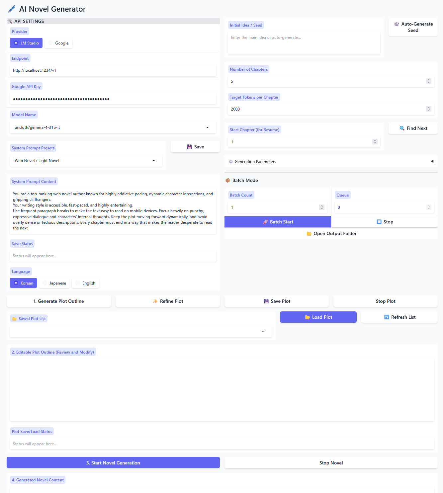

# AI Novel Generator

A powerful AI novel generator that leverages LM Studio and Google Gemini API to create immersive stories chapter-by-chapter.


## Features

- **Dual Provider Support**: Seamlessly switch between local models via **LM Studio** and cloud models via **Google API** (Gemini & Gemma).
- **Automated API Key Loading**: Automatically loads your Google API key from `gemini.txt` for a zero-config experience.
- **Sequential Generation**: Maintains narrative continuity by including previous chapter context in each new generation.
- **Customizable Structure**: Set your preferred plot seed, number of chapters, and target token length.
- **Multi-language Support**: Select between **Korean**, **Japanese** and **English** for your story.
- **Real-time Streaming**: Watch the AI write your novel in real-time within the Gradio interface.
- **Direct Export**: Automatically bundles all generated chapters into a single `.txt` file for easy download.
- **Sequential Output Storage**: All generated novels are automatically saved in the `output/` folder with incremental numbering (e.g., `novel_001.txt`, `novel_002.txt`), ensuring your work is never overwritten.
- **Plot Management**: Save your refined plot outlines to `output/plot/` and easily reload them later to resume or restart story generation.
- **Configurable System Prompt**: Fine-tune the AI's persona via `system_prompt.txt` or choose from curated presets (Literary, Web Novel, Fantasy, Romance, Sci-Fi).
- **AI-powered Seed Generation**: Instantly brainstorm creative story ideas based on your chosen writing style and language.
- **AI-powered Plot Refinement**: Elaborate and polish your plot outline with deeper character motivations and vivid sensory details.
- **Batch Queue Management**: Add multiple batch jobs to a queue. The system automatically processes them sequentially, displaying a real-time counter of pending tasks.

## Prerequisites

- **Python 3.10+**
- **Providers**:
  - **LM Studio**: Local server running on port `1234`.
  - **Google API**: A valid Gemini API key (can be stored in `gemini.txt`).
- **Supported Models**: 
  - **Google (Cloud)**: `gemini-3.1`, `gemini-3`, `gemini-2.5`, `gemma-4` variants.
  - **LM Studio (Local)**: `unsloth/gemma-4`, `qwen/qwen3.5` variants, or any local model identifier.

## Installation

1. **Clone the repository**:
   ```bash
   git clone https://github.com/yourusername/Python_novel.git
   cd Python_novel
   ```

2. **Set up a virtual environment**:
   ```bash
   python -m venv .venv
   # Windows
   .\.venv\Scripts\activate
   # Windows git bash
   source .venv/Scripts/activate
   
   # macOS/Linux
   source .venv/bin/activate
   ```

3. **Install dependencies**:
   ```bash
   pip install -r requirements.txt
   ```

## Narrative Generation Workflows

You can generate your novel using two distinct workflows:

### Workflow A: Manual Full-Control (Recommended)
This mode allows you to refine the story's direction before final generation.
1.  **Input Initial Idea**: Enter a brief concept in the "Initial Idea / Seed" box, or click **🎲 Auto-Generate Seed** to let the AI brainstorm a unique starting point for you.
2.  **Generate Plot**: Click **1. Generate Plot Outline**. The AI will create a chapter-by-chapter summary.
3.  **Refine Plot (Optional)**: Click **✨ Refine Plot**. The AI will act as a story architect to elaborate on the outline, adding emotional depth, sensory details, and better pacing.
4.  **Review & Edit**: **(Crucial Step)** You can manually edit the generated plot in the "2. Editable Plot Outline" box to fix inconsistencies or add specific plot points.
5.  **Save/Load Plot**: Use the **💾 Save Plot** button to store your outline. You can reload previously saved plots from the **📂 Saved Plot List** at any time.
6.  **Start Generation**: Click **3. Start Novel Generation**. The AI will follow your refined plot exactly, chapter by chapter.

### Workflow B: Automated Batch Mode
Perfect for creating multiple variations or generating large volumes of content automatically.
1.  **Input Idea & Batch Count**: Enter your initial idea and the number of independent novels you want to create (e.g., 5).
2.  **Launch**: Click **🚀 Batch Start**.
3.  **Automatic Execution**: The system will automatically:
    - Generate a unique plot outline for each batch iteration.
    - Immediately start generating the novel based on that specific plot.
    - Save each completed novel as a separate `.txt` file in the `output/` directory.
4. **Queue Management**: If you click **🚀 Batch Start** while a batch is already running, the new request will be added to the **Queue**. A counter next to the Batch Count will show the number of pending batches, and they will be processed automatically in the order they were added.
5. **Stopping**: Click **⏹️ Stop** at any time to clear the entire queue and stop all current generation activities.

## Configuration & Advanced Settings

### System Prompt (`system_prompt.txt`)
The application automatically loads the initial system prompt from `system_prompt.txt` at startup. 
- Edit this file or the UI text box to define the global persona, tone, and constraints of your AI novelist.
- Use the **System Prompt Presets** dropdown to quickly switch between different writing styles (e.g., Epic Fantasy vs. Web Novel).
- Click the **💾 Save** button next to the system prompt to overwrite the local `system_prompt.txt` with your current settings.

### AI Seed Generation (🎲)
If you're facing writer's block, the **Auto-Generate Seed** feature uses your current system prompt settings to brainstorm a creative concept. 
- It ensures the generated idea matches the specific tone and genre defined in your persona.
- The output is automatically placed into the "Initial Idea / Seed" box, ready for plot generation.

### Plot Refinement (✨)
The **Refine Plot** feature acts as a "second pass" by a master story architect to improve your outline.
- **Elaboration**: It adds vivid sensory details and deeper character motivations to the existing summary.
- **Consistency**: It polishes the narrative for better emotional resonance and logical consistency.
- **Pacing**: It ensures the story pacing is dynamic and leading toward a powerful climax.
- **Structure**: It maintains the strict 5-section format (Title, Theme, Characters, World, Chapters) while enriching the content.

### Generation Parameters
Adjust these in the "⚙️ Generation Parameters" accordion:
- **Temperature**: Higher values (e.g., 1.2) increase creativity, while lower values (e.g., 0.5) make the output more focused and predictable.
- **Top-P**: Controls the diversity of the vocabulary.
- **Repetition Penalty**: Helps prevent the model from repeating the same phrases or sentences.

## Usage

1. **Prepare Connection**:
   - **For LM Studio**: Load your model and start the "Local Server" on port `1234`.
   - **For Google API**: Ensure your API key is in `gemini.txt` or ready to enter in the UI.
2. **Launch the Generator**:
   ```bash
   python app.py
   ```
3. **Open the Web UI**:
   - Navigate to [http://127.0.0.1:7860](http://127.0.0.1:7860) in your browser.
4. **Configure API**:
   - Select your **Provider** (LM Studio or Google) in the **API SETTINGS** panel.
   - The Endpoint and Model list will update automatically.
5. **Begin Writing**:
   - Input your plot seed, select the language, and click **Generate Novel**.

## UI Preview

The app features a modern, responsive Gradio interface designed for a seamless writing experience.

## License

This project is licensed under the MIT License - see the [LICENSE](LICENSE) file for details.
